# Stereoplot QGIS Plugin: Interactive Structural Data Plotting and Analysis Tool   
*author: [Julien Perret](mailto:julien.perret@uwa.edu.au) & [Mark Jessell](mailto:mark.jessell@uwa.edu.au)*  
*version 1.0.0 - June 2026*

**Stereoplot** was designed as a lightweight QGIS companion for structural geologists who need to move rapidly from mapped or imported structural measurements to **stereonet-based visual inspection**, **filtering**, **classification**, and **publication-ready figure export**.

---

## Credits, Related Tools and Referencing
### *Foundational and Related Work*
- **Joe Kington** — `mplstereonet`, used for stereographic projection functionality.
- **Daniel Childs** — original QGIS stereonet plugin concepts and implementation lineage.
Please also acknowledge these projects where appropriate.

### *Related Projects*
Stereoplot is designed to work well with structural layers generated by the **GEOL-QMAPS** digital geological mapping solution, while remaining usable with independent QGIS structural datasets.
**GEOL-QMAPS repository:** [QGIS project template](https://doi.org/10.5281/zenodo.7834717) and [QGIS plugin](https://github.com/swaxi/GEOL-QMAPS)

### *Citation*
Suggested citation:
> *Perret, J. & Jessell, M.W., 2026. Stereoplot: an interactive QGIS plugin for stereographic projection and structural data visualisation. GitHub repository: [https://github.com/swaxi/Stereoplot](https://github.com/swaxi/Stereoplot).* 

If you use Stereoplot together with GEOL-QMAPS, please also cite the GEOL-QMAPS publication:
> *Perret, J., Jessell, M.W., Bétend, E., 2024. An open-source, QGIS-based solution for digital geological mapping: GEOL-QMAPS. Applied Computing and Geosciences 100197. [https://doi.org/10.1016/j.acags.2024.100197](https://doi.org/10.1016/j.acags.2024.100197).* 

---

# Changelog 1.0.0

       ### Major Functional Improvements
       - Added automatic structural data-type detection.
       - Added support for planar, linear, and combined planar–linear datasets.
       - Added density contouring and best-fit girdle analysis.
       - Improved automatic plot updates when filters and settings change.

       ### Hangingwall Displacement Visualisation
       - Added kinematic arrow plotting.
       - Added automatic kinematics field detection.
       - Added support for common fault-slip kinematic classes.

       ### Classification and Filtering
       - Added attribute-based classification.
       - Added category visibility controls and legends.
       - Added QGIS expression-based filtering.

       ### Styling and Templates
       - Added custom styling for symbols, lines, and kinematic arrows.
       - Added style template save, load, reset, and delete functions.
       - Added project-level style persistence.

       ### Rose Diagrams and Visualisation
       - Improved rose-diagram plotting and scaling.
       - Improved plot layout, legends, and figure appearance.
       - Added additional plotting flexibility for structural datasets.

       ### Settings and Robustness
       - Improved settings persistence and layer switching behaviour.
       - Improved compatibility with GEOL-QMAPS structural datasets.
       - Improved overall stability and user experience.
  
Full changelog: <a href="https://github.com/swaxi/Stereoplot/blob/main/metadata.txt">Metadata</a> 

---

## 1. Description

**Stereoplot** is an open-source QGIS plugin for the interactive stereographic projection, visualisation, filtering, classification, and first-pass analysis of structural geology datasets.

The plugin plots structural measurements from selected QGIS vector layers on **lower-hemisphere, equal-area stereonets** and **rose diagrams**. It supports planar fabrics, linear fabrics, and combined lineation-bearing plane datasets, including structural measurements collected in GEOL-QMAPS-compatible layers or stored in more general point shapefile or GeoPackage architectures.

Stereoplot is intended for:

- rapid inspection of field structural measurements;
- visual comparison of planar and linear fabric populations;
- structural-domain analysis using attribute classification and filtering;
- kinematic visualisation of lineation-bearing plane datasets;
- preliminary fabric analysis using density contours and best-fit girdles;
- export of clean stereonet and rose-diagram figures for reports, teaching material, and publications.

> [!IMPORTANT]
> Stereoplot is a plotting and exploratory analysis tool. Geological interpretation remains the responsibility of the user and must be based on field context, measurement quality, structural overprinting relationships, and the geological question being addressed.

---

## 2. Software Specifications

Stereoplot is a QGIS plugin written in Python and using Matplotlib-based plotting.

| Component | Requirement / status |
|---|---|
| GIS platform | QGIS Desktop |
| Minimum QGIS version | 3.0.0 |
| Maximum QGIS version | 4.99 |
| Qt6 support | Yes |
| Processing provider | No |
| Main plotting backend | Matplotlib + mplstereonet |
| Supported geometry | Vector layers, primarily point layers containing structural attributes |
| Licence | MIT licence, as provided in the repository |

> [!IMPORTANT]
> Make sure that the plugin version is compatible with your QGIS installation. If QGIS reports that the plugin is broken, first check that the plugin folder name, `metadata.txt`, bundled dependencies, and QGIS version are consistent.

---

## 3. Data Requirements

### *3.1. Layer and Geometry Requirements*
Stereoplot is designed primarily for QGIS vector layers containing structural measurements as attributes. Point layers are the standard use case, although the plugin reads attributes rather than relying on point geometry for stereonet calculations.

Recommended formats include:
- GeoPackage (`.gpkg`);
- ESRI Shapefile (`.shp`);
- temporary QGIS scratch layers;
- GEOL-QMAPS-compatible structural layers.

> [!TIP]
> Store structural measurements in numeric fields wherever possible. Text fields containing values such as `045`, `45°`, or `45 deg` may require cleaning before plotting.

### *3.2. Recognised Structural Fields*

Stereoplot recognises several common field-name variants.

| Measurement field | Recognised field names |
|---|---|
| Strike | `Strike_RHR`, `Strike`, `strike` |
| Dip direction | `Dip_Direction`, `Dip_Dir`, `DipDirection`, `dip_direction`, `DipDir`, `DIPDIR` |
| Dip | `Dip`, `dip` |
| Trend / azimuth / bearing | `Azimuth`, `azimuth`, `Bearing`, `bearing`, `Trend`, `TREND` |
| Plunge | `Plunge`, `plunge` |
| Associated bearing-plane strike | `Strike_ref`, `Strike_Ref`, `strike_ref` |
| Associated bearing-plane dip direction | `DipDir_ref`, `Dip_Dir_ref`, `DipDirection_ref`, `Dip_Direction_ref`, `DipDirection_Ref`, `dipdir_ref`, `dip_dir_ref`, `dip_direction_ref` |
| Associated bearing-plane dip | `Dip_ref`, `Dip_Ref`, `dip_ref` |
| Kinematics | `Kinematics`, `kinematics`, `Kinematic`, `kinematic`, `Kin`, `kin`, `Movement`, `movement`, `SlipSense`, `Slip_Sense`, `slip_sense`, `ShearSense`, `Shear_Sense`, `shear_sense`, `SenseOfMovement`, `Sense_of_Movement`, `sense_of_movement` |
| Pitch | `Pitch_RHR`, `Pitch_rhr`, `Pitch_Rhr`, `Pitch`, `pitch_rhr`, `RHR_pitch`, `rhr_pitch`, `pitch` |

> [!CAUTION]
> Do not mix strike conventions within the same field. If part of the dataset uses right-hand-rule strike and another part uses dip direction within the same field, data will be incorrectly plotted.

---

## 4. Installation
1. Download the latest ZIP package from the [Stereoplot GitHub repository](https://github.com/swaxi/Stereoplot).
2. Open **QGIS Desktop**.
3. Go to **Plugins > Manage and Install Plugins...**.
4. Select **Install from ZIP**.
5. Browse to the downloaded Stereoplot ZIP file.
6. Click **Install Plugin**.
7. Activate the plugin if it is not enabled automatically, and toggle it on in the QGIS Toolbar.

Once installed and activated, the user can access the plugin _via_ these buttons in the _QGIS Toolbar_: 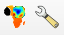
The **Stereoplot Settings** wrench icon opens a _Settings_ pop-up window, and clicking the **Stereoplot** stereonet icon enables plotting the data. 

---

## 5. Workflow
The general **Stereoplot** workflow is intentionally simple:

1. load a structural dataset into QGIS;
2. select the layer and the structural features to plot;
3. configure plotting options, including classification and filtering options;
4. generate the stereonet or rose diagram;
5. modify styling options and categories plotted (if classification is applied) and analyse data,
6. export the result as an image.

### *5.1. Quick Start Guide*
#### 5.1.1. Select a structural layer
Select a point layer containing structural measurements in the QGIS **Layers** panel.
The plugin inspects the selected layer and attempts to detect whether it contains:
- planar measurements;
- linear measurements;
- lineations with associated bearing planes.

> [!TIP]
> A default plotting mode is defined for each, but open the _Settings_ menu to define preferences (see below).

#### 5.1.2. Select the features to plot
Use standard QGIS selection tools (_e.g.,_ **Select Features by Area or Single Click**, **Select by Expression**, or **Select by Location**) to select the features to be plotted in the selected layer.

> [!CAUTION]
> The QGIS **Identify Features** tool does not create a feature selection. Use a true selection tool, such as **Select Features by Area or Single Click**, **Select by Expression**, or **Select by Location**.

#### 5.1.3. Open the Stereoplot settings
Click the **Stereoplot Settings** button to configure the plot.

_The **Stereoplot Settings** window is divided in different panels: Plotting options, Classification and Filtering_
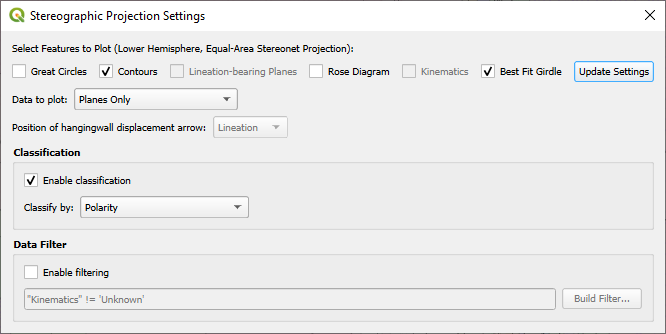

Available settings for plotting include:
- __great circles__****;
- __contours__**** (_i.e.,_ Kamb contours for plane poles or lineations, depending on the _Data type to plot_ selected);
- __lineation-bearing planes__**** (only available for layers containing L-S fabric measurements);
- __rose diagram mode__****;
- __kinematics__**** (_i.e.,_ plotting of the hangingwall displacement arrow in case of L-S fabrics);
- __best-fit girdle__****.

Two extra-panels enable to classify data to plot based on an attribute of the layer, and to filter out entities to plot.

#### 5.1.4. Generate the plot
Click the **Stereoplot** button.
Stereoplot reads the selected features, extracts recognised structural fields, applies any active filter or classification, and opens the plot window from which further styling and export functionalities are available.

---

## 6. Detailed Functionality
### *6.1. Automatic Structural Data-Type Detection*
Stereoplot automatically checks selected vector layers for recognised structural fields.

| Detected data type | Required measurements | Typical display |
|---|---|---|
| **Planes Only** | Strike + Dip, or Dip Direction + Dip | poles to planes, great circles, contours, rose diagrams |
| **Lineations Only** | Trend/Azimuth/Bearing + Plunge | lineations, contours, rose diagrams |
| **Lineations with Bearing Planes** | Trend/Azimuth/Bearing + Plunge, plus Strike/Dip or Dip Direction/Dip for the associated plane | lineations, bearing planes, kinematic arrows, contours |

> [!TIP]
> Automatic detection is useful for routine work, but the **Data to plot** dropdown can be used to override the detected mode when a dataset contains ambiguous or non-standard field combinations.

### *6.2. Stereonet Plotting*
Stereoplot uses a lower-hemisphere, equal-area projection for stereonet plots.
Different plotting options are available depending on the data type to plot.

#### 6.2.1. Planar- and linear-only orientation measurements
##### Poles to planes or lines (when all options are toggled off)
 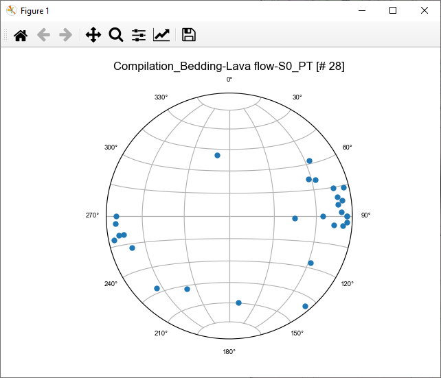

##### Great circles (for planar features only)
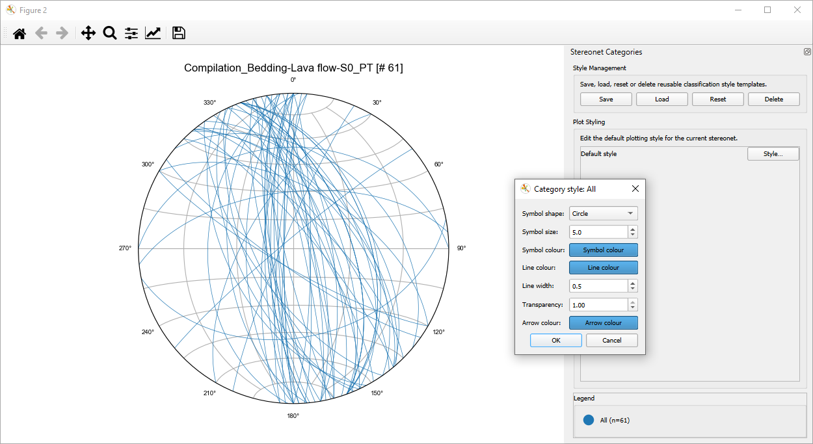

##### Contours
Generates Kamb contour lines (sigma-level) for the poles-to-planes or lineation dataset plotted in the stereonet.
The contours and related colourscale bar update dynamically when:
- categories are hidden or shown;
- filters are modified;
- classification settings change.
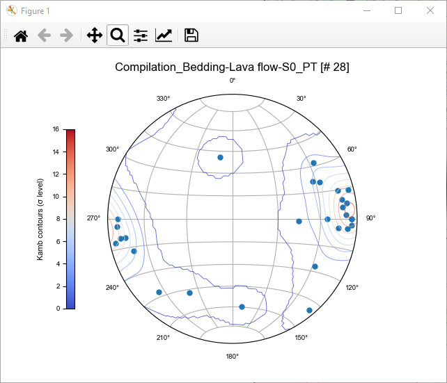

> [!TIP]
> Use contours on sufficiently populated datasets. For small datasets, individual points may be more informative than smoothed density fields.

##### Rose diagram
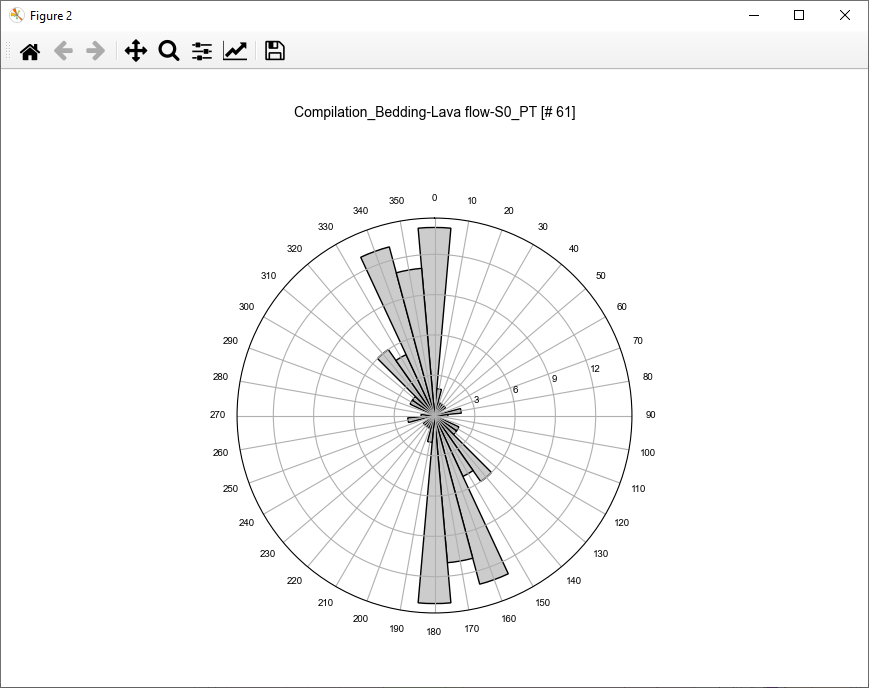

> [!IMPORTANT]
> Rose diagrams flatten three-dimensional orientation information into azimuthal frequency distributions. They should not be used as a substitute for stereonet analysis where plunge, dip, and full 3D geometry matter.

##### Best-fit girdle (for planar features only, ≥3 measurements plotted)
This is useful for estimating fold-axis trends from girdle distributions, checking whether foliations form a coherent great-circle distribution, or comparing structural domains.

_The best-fit girdle and its pole are plotted, and a legend box provides fabric statistics and orientation. Another pop-up styling window is opened_
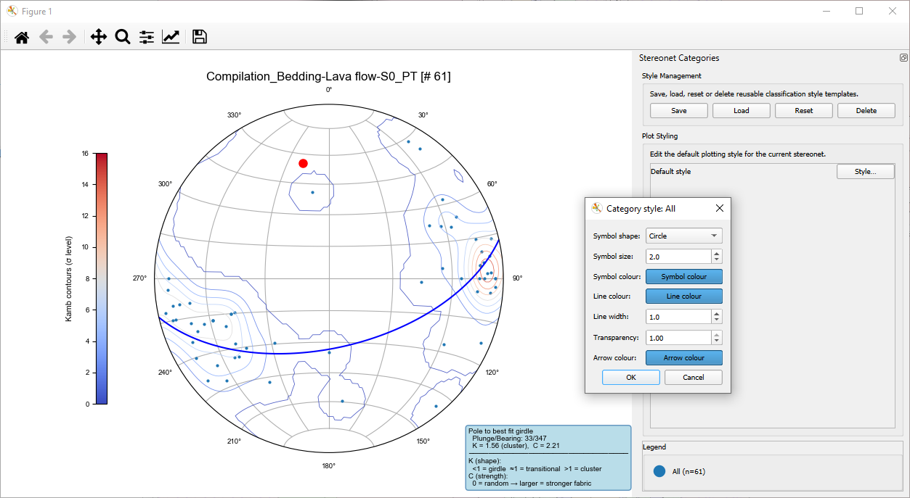

Stereoplot reports basic fabric statistics based on covariance eigenvalues.
**Woodcock K-value**
```text
K = ln(e1/e2) / ln(e2/e3)
```
**Fabric strength C**
```text
C = ln(e1/e3)
```
where:
```text
e1 ≥ e2 ≥ e3
```
are covariance eigenvalues.

Higher values indicate stronger preferred orientation in the plotted population. The pole to the best-fit girdle is plotted and its orientation is reported as Dip/DipDir. 

The girdle updates dynamically when:
- categories are hidden or shown;
- filters are modified;
- classification settings change.


> [!IMPORTANT]
> Statistical outputs should be interpreted as descriptive fabric indicators, not as standalone geological proof. Data clustering, structural-domain mixing, sampling bias, and repeated measurements from the same outcrop can strongly affect the result.

#### 6.2.2. Combined planar-linear orientation measurements (lineations with bearing planes)
Combined datasets can display lineations together with their associated bearing planes, in case of S-L tectonics for instance (_e.g.,_ slickenlines on fault planes, stretching lineations within shear fabrics, and fold axes associated with axial surfaces).

> [!CAUTION]
> It requires that the input layer has different fields reporting trend, plunge, strike (and/or dip direction) and dip values.

##### Lineation-bearing planes
Plots lineations or fold axes and their bearing planes as great circles if their orientation is provided.
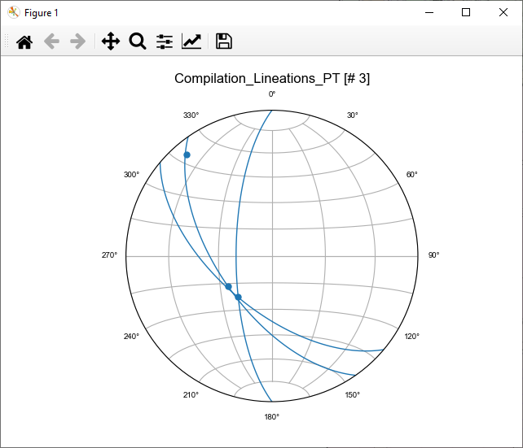

#### Kinematics
For S-L fabric measurements with kinematic indicators, arrows are designed to visualise inferred hangingwall displacement directions for lineation-bearing plane datasets.
The arrow is plotted as a segment tangential to the great circle defined by the lineation and pole to bearing-plane, and the way it points depends on the kinematics indicator field value.
The settings dialog allows users to choose the position of the hangingwall displacement arrow, either on the **Plane pole** or the **Lineation**.

Kinematic arrows therefore require, for each plotted feature:
- a valid lineation orientation;
- a valid associated bearing-plane orientation;
- a recognised kinematic value.

Features lacking one of these components may still be plotted as lineations, but they will not generate kinematic arrows.

_Lineations can be plotted alone (top) or with their bearing planes and kinematic arrows, i.e., hangingwall displacement direction, if information is available (bottom)_
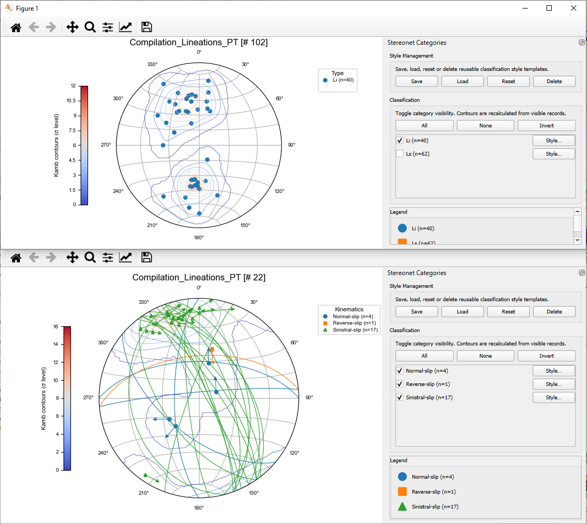

_**Values recognised for kinematics indicator:**_
| Recognised examples |
|---|
| `Sinistral`, `Sinistral-slip`, `Left-lateral`, `Sin` |
| `Dextral`, `Dextral-slip`, `Right-lateral`, `Dex` |
| `Normal`, `Normal-slip`, `Extensional` |
| `Reverse`, `Reverse-slip`, `Thrust`, `Compressional` |

Values such as `Unknown`, `Undefined`, `Undetermined`, `N/A`, or equivalent non-diagnostic entries should be treated as non-plottable for kinematic arrows.

---

## 7. Classification, Filtering and Interactive Data Selection Tools
### *7.1. Attribute-Based Classification*
Classification allows selected features to be grouped by any attribute field in the selected layer.
When classification is enabled, **Stereoplot** automatically generates categories from unique attribute values and displays an interactive category legend, that can be edited.

_Classification allows here to distinguish between different fold attitudes. Each value can be toggled on and off, and the fold axis contouring is automatically updated. Each or legend entry can also be styled in a custom fashion (custom styles may then be saved_
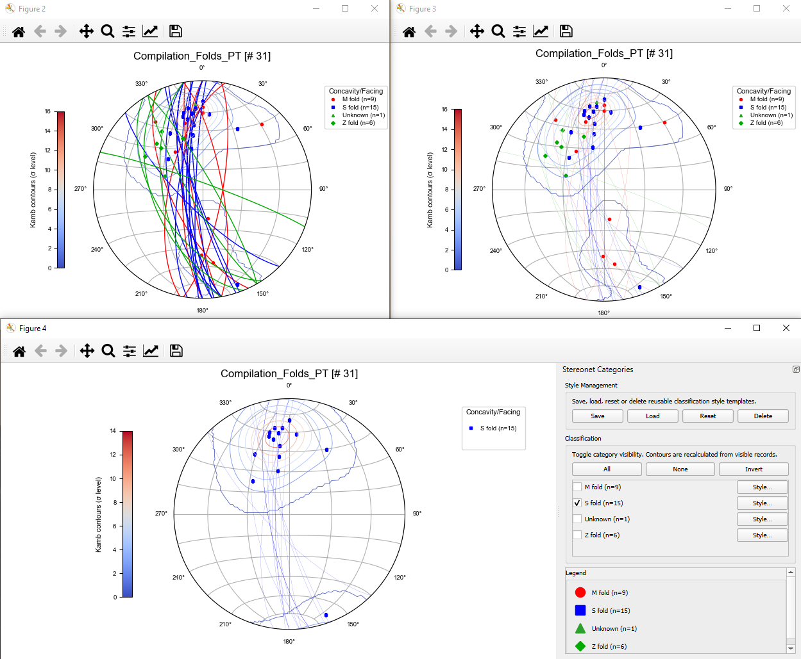

### *7.2. Category Visibility*
For each category, users can:
- show or hide individual categories;
- select all categories;
- hide all categories;
- invert category visibility.

The plot updates dynamically without needing to recreate the stereonet.

### *7.3. Category Styling*
Each category may be styled independently.
Supported styling options include:
- symbol shape;
- symbol colour;
- symbol size;
- line colour;
- line width;
- transparency;
- arrow colour.

### *7.4. Style Templates*
Style templates can be:
- saved;
- loaded;
- reset;
- deleted.

Project-level style persistence is stored in:
```text
stereonet_styles.json
```

Stereoplot settings are stored in:
```text
stereonet.json
```
where project-level configuration is available, with QSettings used as a fallback.

### *7.5. Attribute Filtering*

Stereoplot uses native QGIS expressions for filtering.

_Examples:_

```sql
"Generation" = 'D2'
```

```sql
"Kinematics" IN ('Sinistral-slip', 'Reverse-slip')
```

```sql
"Generation" = 'D2'
AND "Kinematics" IS NOT NULL
```

Filtering can be used before plotting or during exploratory analysis to reduce a dataset to a subpopulation relevant.

> [!TIP]
> Use QGIS field aliases for readable forms, but keep provider field names short, stable, and explicit. Stereoplot stores and evaluates the real field name, not only the displayed alias.


### *7.1. Interactive Data Selection*
Stereoplot includes an interactive data selection tool that enables direct interrogation of structural datasets from the stereonet views. 
This allows users to rapidly isolate structural populations, investigate outliers, validate classifications, and explore relationships between mapped features and their stereographic representation.

To select data interactively:
1. Plot planar data as poles or lineations.
2. Click on an individual pole or lineation, or click and drag with the left mouse button to draw a freehand **lasso selection**, allowing multiple measurements to be selected in a single operation. Release the mouse button to validate the selection.
3. Hold **Ctrl** while clicking or drawing another lasso selection to add features from the current selection.
6. Selected features are surounded by a red halo and are automatically highlighted/selected in the source QGIS layer and attribute table.

_a - All data plotted defining the tight to isoclinal folding pattern are selected in QGIS, and thus highlighted in the map canvas_
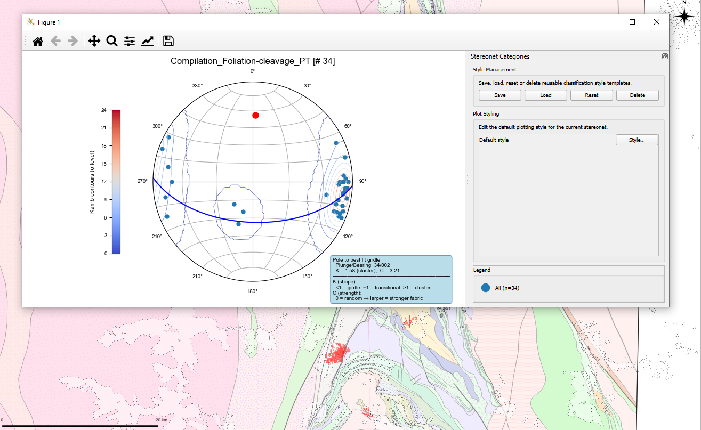

_b - Limb measurements selected in the stereonet are highlighted in the map canvas_


_c - Hinge measurements selected in the stereonet are highlighted in the map canvas_
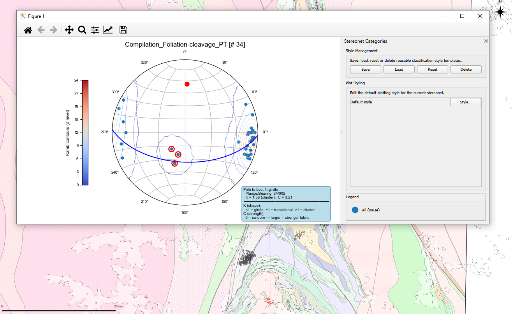

---

## 8. Export Options

Stereoplot figures can be exported directly from the plot window.

_Recommended export workflow:_
1. apply filters and category visibility settings;
2. refine category styling;
3. check legend readability;
4. resize the plot window if needed;
5. export the final figure.

---

## 9. Tips and Warnings

### *9.1. Best-Practice Recommendations*

> [!TIP]
> **Prepare structural fields before plotting.** Use clear numeric fields for strike, dip direction, dip, trend, and plunge. Avoid mixing text, symbols, and numbers in the same measurement field.

> [!TIP]
> **Separate structural populations logically.** Use attributes such as `Generation`, `Domain`, `Lithology`, `Structure_Type`, or `Confidence` so that classification and filtering can be used effectively.

> [!TIP]
> **Use projected CRS for map-based structural workflows.** Although stereonet calculations use orientation attributes rather than map geometry, structural data preparation and validation in QGIS are usually clearer in an appropriate projected CRS.

> [!TIP]
> **Check measurement conventions before interpretation.** Confirm whether planar data are stored as right-hand-rule strike/dip or dip-direction/dip before plotting great circles, poles, or kinematic arrows.

> [!TIP]
> **Filter before contouring.** If multiple deformation phases, domains, or lithologies are mixed, contours may show blended maxima that do not correspond to any single geological population.

> [!TIP]
> **Keep original data unchanged.** Clean or standardise measurements in a copy of the dataset, especially when converting legacy fields or harmonising strike and dip-direction conventions.

### *9.2. Common User Mistakes*

> [!WARNING]
> **No selected features.** Stereoplot plots selected features. If the selected layer contains data but no features are selected, the plot may be empty or incomplete.

> [!WARNING]
> **Using Identify instead of Select.** The QGIS Identify tool does not create selected features. Use QGIS selection tools or selection expressions.

> [!WARNING]
> **Mixed conventions.** Mixing strike, dip direction, right-hand-rule strike, and arbitrary strike in the same dataset can produce incorrect stereonet geometries.

> [!WARNING]
> **Invalid numeric ranges.** Check that dip and plunge values are between 0° and 90°, and that azimuthal values are between 0° and 360°.

> [!WARNING]
> **Over-interpreting contours.** Density contours depend on sample size, smoothing approach, and structural population selection. They should not be interpreted without considering sampling bias.

> [!WARNING]
> **Kinematic ambiguity.** Kinematic arrows depend on the encoded movement sense and the associated bearing plane. They should be used only where the structural measurement and kinematic interpretation are internally consistent.

### *9.3. Practical Structural Data Checklist*

Before plotting, check that:

- the correct QGIS layer is selected;
- the intended features are selected;
- structural fields are numeric and consistently named;
- planar measurements use a consistent convention;
- lineations have both trend and plunge values;
- combined datasets store the lineation and bearing plane on the same feature;
- kinematic classes are standardised where kinematic arrows are required;
- null, unknown, or uncertain measurements are clearly encoded;
- classification fields contain meaningful, non-random categories.

---

## 10. Troubleshooting

### *10.1. The plugin does not appear in QGIS*

Check that:

- the plugin folder is inside the active QGIS profile plugin directory;
- the folder is not nested inside another extracted ZIP folder;
- `metadata.txt` is present at the top level of the plugin folder;
- QGIS has been restarted after installation;
- the plugin is enabled in **Plugins > Manage and Install Plugins...**.

### *10.2. The plot is empty*

Possible causes:

- no features are selected;
- the wrong layer is selected;
- the selected features contain null structural measurements;
- field names are not recognised;
- filtering removes all features;
- the selected plotting mode does not match the available fields.

Suggested checks:

1. Clear any filter expression.
2. Select a small number of known valid features.
3. Confirm that the expected structural fields exist.
4. Manually set **Data to plot** in the settings dialog.
5. Try plotting without classification or contours first.

### *10.3. Great circles or poles look wrong*

Possible causes:

- strike is not stored using the expected convention;
- dip direction has been stored in a strike field;
- dip values are not numeric;
- azimuthal values include quadrant notation or text symbols;
- data were imported from legacy sources without harmonisation.

### *10.4. Kinematic arrows do not appear*

Check that:

- **Kinematics** is enabled;
- the selected dataset includes lineations;
- a valid kinematics field was selected;
- kinematic values are recognised;
- associated bearing-plane fields are populated;
- the selected plotting mode is **Lineations Only** or **Lineations with Bearing Planes** as appropriate.

### *10.5. Classification does not work as expected*

Check that:

- the classification field exists in the selected layer;
- the field contains populated values for selected features;
- the selected layer has not changed since settings were saved;
- categories have not been hidden in the interactive legend;
- aliases and real provider field names are not being confused.

### *10.6. Contours do not update*

Contours are recalculated from the visible data. If the contour pattern looks stale or unexpected:

1. check category visibility;
2. check the active filter expression;
3. disable and re-enable contours;
4. reopen the plot after updating settings;
5. verify that the visible dataset contains enough measurements.

---

